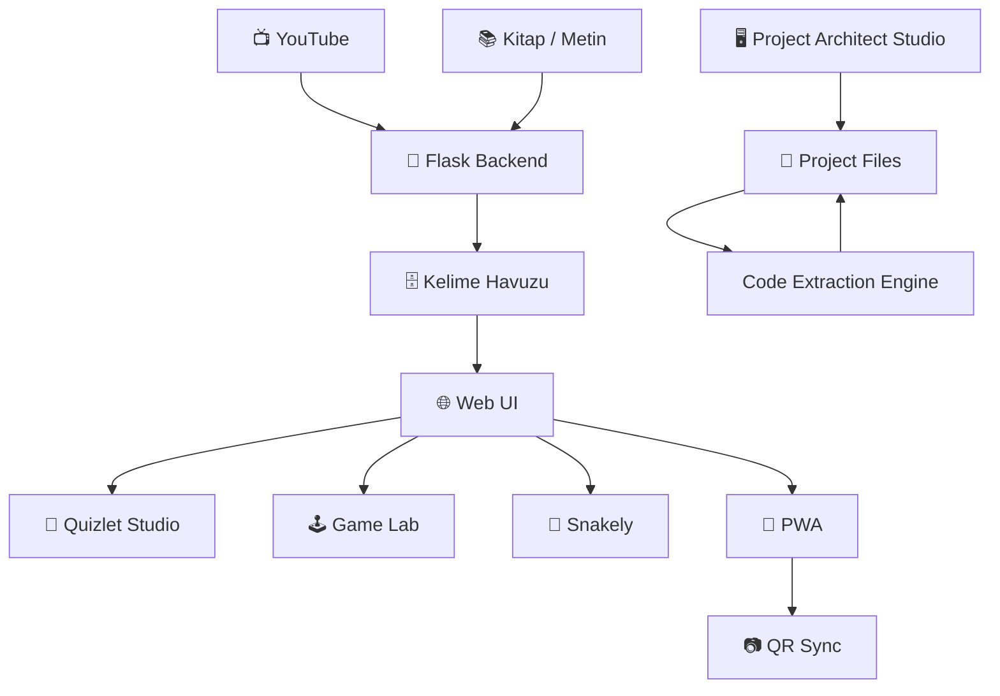

<div align="center">

```text
██╗   ██╗████████╗    ██╗   ██╗ ██████╗  ██████╗ █████╗ ██████╗
╚██╗ ██╔╝╚══██╔══╝    ██║   ██║██╔═══██╗██╔════╝██╔══██╗██╔══██╗
 ╚████╔╝    ██║       ██║   ██║██║   ██║██║    ███████║██████╔╝
  ╚██╔╝     ██║       ╚██╗ ██╔╝██║   ██║██║    ██╔══██║██╔══██╗
   ██║      ██║        ╚████╔╝ ╚██████╔╝╚██████╗██║  ██║██████╔╝
   ╚═╝      ╚═╝         ╚═══╝   ╚═════╝  ╚═════╝╚═╝  ╚═╝╚═════╝

        S T U D Y   S T U D I O  ×  S N A K E L Y   S T U D I O
```

### 🎬 → 🧠 → 🕹️ → 📱

# YT Vocab Study Studio & Snakely Studio

**YouTube'dan kelimeye, kelimeden oyuna, oyundan cebine.**

Uçtan uca, oyunlaştırılmış ve modüler bir dil öğrenme ekosistemi.

[](https://www.python.org/)
[](https://flask.palletsprojects.com/)
[](https://www.qt.io/)
[](https://azure.microsoft.com/)
[](https://nginx.org/)
[](#)
[](#)
[](#-lisans)

</div>

---

## 📖 İçindekiler

* [Proje Hakkında](#-proje-hakkında)
* [Felsefe](#-projenin-felsefesi)
* [Temel Özellikler](#-temel-özellikler)
* [Sistem Mimarisi](#️-sistem-mimarisi)
* [Teknik Yığın](#️-teknik-yığın)
* [Proje Dizin Yapısı](#-proje-dizin-yapısı)
* [Yerel Kurulum](#-yerel-kurulum)
* [Azure Dağıtımı](#️-azure-üzerinde-dağıtım)
* [API ve Rotalar](#-api-ve-rotalar)
* [Klavye Kısayolları](#️-klavye-kısayolları)
* [Açık Kaynak](#-açık-kaynak-felsefesi)
* [Lisans](#-lisans)
* [Katkıda Bulunma](#-katkıda-bulunma)

---

# 🌍 Proje Hakkında

**YT Vocab Study Studio & Snakely Studio**, gerçek dünyadaki içerikleri interaktif bir dil öğrenme deneyimine dönüştürmek amacıyla geliştirilmiş modüler bir eğitim platformudur.

Temel fikir basittir:

> **İzle → Keşfet → Öğren → Tekrar Et → Oyna → Hatırla**

Platform; YouTube altyazıları, kitaplar ve serbest metinlerden kelime ve kelime öbekleri çıkarabilir. Bu içerikler daha sonra flashcard sistemleri, SRS tabanlı tekrar mekanikleri, testler ve oyunlaştırılmış öğrenme modülleri içerisinde kullanılabilir.

Proje aynı zamanda masaüstü geliştirme araçları ve web tabanlı öğrenme deneyimlerini aynı ekosistem içerisinde birleştirmeyi hedefler.

---

# 💡 Projenin Felsefesi

Bu projenin en önemli amacı yalnızca çalışan bir uygulama oluşturmak değil, **başkalarının da üzerine inşa edebileceği bir temel oluşturmak**.

Bu nedenle proje mümkün olduğunca modüler, okunabilir ve geliştirilebilir şekilde tasarlanmıştır.

Kodları inceleyebilir, değiştirebilir, kendi projenize uyarlayabilir, yeni özellikler ekleyebilir, farklı bir arayüz oluşturabilir veya projeyi tamamen farklı bir yöne taşıyabilirsiniz.

**Projeyi olduğu gibi kullanmak zorunda değilsiniz.**

Fork'layın.

Değiştirin.

Parçalarını başka projelerde kullanın.

Yeni oyunlar ekleyin.

Yeni öğrenme algoritmaları geliştirin.

Kendi eğitim platformunuzu oluşturun.

Bu projenin geleceğini yalnızca orijinal geliştiricinin değil, **onu kullanan ve geliştiren herkesin şekillendirmesi** amaçlanmaktadır.

---

# 🧠 Temel Özellikler

## 🎬 Video & Metin Madenciliği

* YouTube altyazılarından otomatik transkript çıkarma
* Kelime ve kelime öbeği frekans analizi
* Phrasal verb tespiti
* Öğrenilebilirlik odaklı kelime seçimi
* Kitap ve uzun metin desteği
* Otomatik metin sayfalama
* Kelime üzerine anlık çeviri
* Web Speech API ile telaffuz

---

## 🧠 Quizlet Studio

Çeşitli öğrenme yöntemlerini tek bir çalışma alanında birleştirir.

| Mod           | Açıklama                                     |
| ------------- | -------------------------------------------- |
| 🃏 Flashcards | 3D kart çevirme ve sesli telaffuz            |
| 👉 Swipe      | Bilinen/bilinmeyen kelimeleri hızlıca ayırma |
| 🧠 Learn      | Aşamalı öğrenme sistemi                      |
| 📝 Test       | Çoktan seçmeli ve klavye tabanlı test        |
| 🔗 Match      | Terim ve anlam eşleştirme                    |
| 🔊 TTS        | Sesli kelime ve cümle desteği                |
| 🔀 Shuffle    | Rastgele çalışma sıralaması                  |

---

# 🕹️ Oyunlaştırma Laboratuvarı

Öğrenmeyi yalnızca kart ve testlerden ibaret bırakmak yerine oyun mekanikleriyle birleştirmeyi amaçlar.

### ⛏️ Vocab Miner

WebGL/WASM tabanlı oyunlaştırılmış kelime öğrenme deneyimi.

Kelime bilgisi oyun dünyasının içerisine entegre edilir.

### 🕹️ Retro Arcade

Retro oyun deneyimini kelime doğrulama mekanikleriyle birleştiren deneysel öğrenme alanı.

### 🎲 Mini Games

Canvas tabanlı çeşitli mini oyunlar ve deneysel öğrenme mekanikleri.

### 🐍 Snakely Studio

Seviye tabanlı, oyunlaştırılmış kelime öğrenme sistemi.

* A1 → C1 seviye yapısı
* Can/kalp sistemi
* Sandık mekaniği
* Streak sistemi
* SRS entegrasyonu
* Zorluk eğrisi
* Seviye bazlı ilerleme

---

# 🖥️ Project Architect Studio

Projede ayrıca PyQt6 tabanlı bir masaüstü yardımcı uygulaması bulunmaktadır.

**Project Architect Studio**, kod üretim süreçlerinden elde edilen dosyaları otomatik olarak ayrıştırmak, hedef dosyalarını belirlemek ve proje içerisine yazmak amacıyla tasarlanmıştır.

Sistem:

* Kod bloklarını DOM içerisinden tespit edebilir
* Dosya isimlerini otomatik algılayabilir
* Kod dilini analiz edebilir
* Hedef dosya yolunu tahmin edebilir
* Dosyaları staging alanında gösterebilir
* Kodları doğrudan diske yazabilir
* Yapılan değişiklikler için undo geçmişi tutabilir
* Proje mimarisini çıkarabilir
* Proje dosyalarını bir "memory" çıktısı halinde panoya aktarabilir

Extractor motoru; özel dosya direktifleri, Markdown code fence'leri, DOM metadata'sı ve içerik tabanlı heuristic analiz kullanır.

Masaüstü tarafında ise PyQt6 ve opsiyonel Qt WebEngine kullanılarak Gemini Web arayüzü, staging alanı, dosya gezgini, kod editörü ve proje yönetim ekranları bir araya getirilmiştir.

---

# 🏗️ Sistem Mimarisi



---

# 🛠️ Teknik Yığın

| Katman         | Teknolojiler                               |
| -------------- | ------------------------------------------ |
| Backend        | Python 3.12 · Flask · Gunicorn             |
| Desktop        | Python · PyQt6 · Qt WebEngine              |
| Frontend       | HTML5 · CSS3 · Vanilla JavaScript          |
| Learning       | SRS · TTS · Web Speech API                 |
| Games          | Canvas · WebGL · WASM                      |
| PWA            | Service Worker · LocalStorage              |
| Infrastructure | Azure Linux VM · Ubuntu · Nginx · Systemd  |
| Utilities      | QRCode.js · Html5-Qrcode · Chart.js        |
| Extraction     | DOM Inspector · Regex · Heuristic Analysis |

---

# 📂 Proje Dizin Yapısı

```text
yt-vocab-study-studio/
│
├── app.py
├── wsgi.py
├── requirements.txt
├── .env.example
├── README.md
│
├── core/
│   ├── transcript_miner.py
│   ├── book_parser.py
│   ├── srs_engine.py
│   └── distractor_engine.py
│
├── routes/
│   ├── api_transcript.py
│   ├── api_vocab.py
│   ├── mobile_routes.py
│   └── snakely_routes.py
│
├── static/
│   ├── css/
│   ├── js/
│   │   ├── quizlet/
│   │   ├── games/
│   │   ├── vocab-miner/
│   │   ├── arcade/
│   │   ├── snakely/
│   │   └── qr-sync.js
│   │
│   └── assets/
│
├── templates/
│   ├── index.html
│   ├── reader.html
│   ├── mobile/
│   └── snakely/
│
├── deploy/
│   ├── nginx.conf
│   └── yt-vocab.service
│
└── desktop/
    ├── gemini_sidecar.py
    └── extractor_engine.py
```

---

# 💻 Yerel Kurulum

## Gereksinimler

* Python 3.12+
* pip
* venv
* Git
* Opsiyonel: Node.js
* Desktop Studio için PyQt6
* WebEngine özellikleri için PyQt6-WebEngine

## Kurulum

```bash
git clone https://github.com/<kullanici-adi>/yt-vocab-study-studio.git

cd yt-vocab-study-studio

python3 -m venv venv

source venv/bin/activate

# Windows:
# venv\Scripts\activate

pip install -r requirements.txt
```

Ardından:

```bash
cp .env.example .env
```

`.env` dosyasını kendi ortamınıza göre düzenleyin.

Uygulamayı çalıştırmak için:

```bash
flask run --debug
```

veya:

```bash
python app.py
```

Varsayılan geliştirme adresi:

```text
http://127.0.0.1:5000
```

---

# 🖥️ Project Architect Studio

Desktop Studio'yu çalıştırmak için:

```bash
python gemini_sidecar.py
```

WebEngine desteği gerekiyorsa:

```bash
pip install PyQt6-WebEngine
```

Uygulama içerisindeki temel akış:

```text
Gemini Web
     ↓
DOM Inspector
     ↓
Code Extraction Engine
     ↓
Staging
     ↓
Dosya Hedefleme
     ↓
Disk
     ↓
Project Explorer
```

Extractor tarafında kod blokları için dosya adı; DOM metadata'sı, kod başındaki direktifler, başlıklar, yakın metin ve içerik sentaksı gibi birden fazla sinyal kullanılarak belirlenebilir.

---

# ☁️ Azure Üzerinde Dağıtım

Örnek üretim mimarisi:

```text
Internet
   │
   ▼
Nginx
   │
   ▼
Gunicorn
   │
   ▼
Flask
   │
   ▼
YT Vocab Study Studio
```

Ubuntu üzerinde temel paketler:

```bash
sudo apt update
sudo apt upgrade -y

sudo apt install -y \
    python3.12 \
    python3.12-venv \
    python3-pip \
    nginx \
    git
```

Virtual environment:

```bash
python3.12 -m venv venv

source venv/bin/activate

pip install -r requirements.txt
pip install gunicorn
```

Gunicorn:

```bash
gunicorn \
    --workers 3 \
    --bind 0.0.0.0:8000 \
    wsgi:app
```

Üretim ortamında Nginx reverse proxy ve Systemd ile servis olarak çalıştırılması önerilir.

---

# 🔌 API ve Rotalar

| Method | Route                 | Açıklama                   |
| ------ | --------------------- | -------------------------- |
| `GET`  | `/`                   | Ana panel                  |
| `POST` | `/api/transcript`     | YouTube transkript analizi |
| `GET`  | `/api/vocab`          | Kelime havuzu              |
| `POST` | `/api/vocab/add`      | Kelime ekleme              |
| `GET`  | `/reader`             | Smart Reader               |
| `GET`  | `/quizlet/<mode>`     | Öğrenme modları            |
| `GET`  | `/miner`              | Vocab Miner                |
| `GET`  | `/arcade`             | Retro Arcade               |
| `GET`  | `/snakely`            | Snakely Studio             |
| `GET`  | `/snakely/level/<id>` | Seviye başlatma            |
| `GET`  | `/m`                  | Mobil PWA                  |
| `GET`  | `/m/qr-sync`          | QR Sync                    |
| `GET`  | `/manifest.json`      | PWA manifest               |

---

# ⌨️ Klavye Kısayolları

| Tuş        | İşlev                    |
| ---------- | ------------------------ |
| `Space`    | Kartı çevir / Play-Pause |
| `←` / `→`  | Önceki / Sonraki         |
| `↑` / `↓`  | Biliyorum / Bilmiyorum   |
| `Enter`    | Cevabı onayla            |
| `Ctrl + Z` | Undo                     |
| `S`        | Shuffle                  |
| `M`        | Mute                     |
| `Esc`      | Ana menü                 |
| `Q`        | QR Sync                  |

---

# 👐 Açık Kaynak Felsefesi

Bu repository'nin amacı bir yazılımı kapalı bir kutu haline getirmek değildir.

Tam tersine:

**Koddan öğrenmenizi istiyoruz.**

**Kodu değiştirmenizi istiyoruz.**

**Projeyi fork'lamanızı istiyoruz.**

**Hataları düzeltmenizi istiyoruz.**

**Yeni özellikler geliştirmenizi istiyoruz.**

**Kendi projelerinizi bunun üzerine kurmanızı istiyoruz.**

Bu projeyi yalnızca "kullanıcı" olarak görmek zorunda değilsiniz.

İsterseniz:

* Kendi dil öğrenme sisteminizi oluşturabilirsiniz.
* Kendi SRS algoritmanızı yazabilirsiniz.
* Yeni oyunlar ekleyebilirsiniz.
* Arayüzü tamamen değiştirebilirsiniz.
* Backend'i başka bir teknolojiye taşıyabilirsiniz.
* Projenin yalnızca belirli bir modülünü alabilirsiniz.
* Kodun bir kısmını başka bir projede kullanabilirsiniz.
* Ticari bir ürün oluşturabilirsiniz.
* Projeyi eğitim amacıyla kullanabilirsiniz.
* Fork oluşturup kendi versiyonunuzu sürdürebilirsiniz.

**Kısacası: Projeyi alın ve onunla bir şeyler inşa edin.**

---

# 🤝 Katkıda Bulunma

Pull request'ler, issue'lar, hata raporları, fikirler ve yeni özellikler memnuniyetle karşılanır.

Katkıda bulunmak için:

```bash
git clone https://github.com/<kullanici-adi>/yt-vocab-study-studio.git

cd yt-vocab-study-studio

git checkout -b feature/yeni-ozellik
```

Değişikliklerinizi yaptıktan sonra:

```bash
git add .

git commit -m "feat: yeni öğrenme modu eklendi"

git push origin feature/yeni-ozellik
```

Ardından bir Pull Request oluşturabilirsiniz.

---

# 📜 Lisans

Bu proje **MIT License** altında dağıtılmaktadır.

MIT lisansı kapsamında bu yazılımı:

* Kullanabilir,
* Kopyalayabilir,
* Değiştirebilir,
* Birleştirebilir,
* Dağıtabilir,
* Alt lisanslayabilir,
* Ticari amaçlarla kullanabilir,
* Kendi projelerinizin parçası haline getirebilirsiniz.

Projeyi kendi ihtiyaçlarınıza göre değiştirmekte özgürsünüz.

Ancak yazılım **olduğu gibi**, herhangi bir garanti olmaksızın sunulmaktadır.

Detaylar için repository içerisindeki `LICENSE` dosyasına bakınız.

> **Not:** Repository'ye gerçekten MIT lisansı eklemek istiyorsanız, yalnızca README'yi değiştirmek yeterli değildir. Kök dizine ayrıca `LICENSE` dosyası eklenmelidir.

---

# ⚠️ Üçüncü Taraf İçerikler

Bu repository içerisindeki bazı özellikler veya entegrasyonlar üçüncü taraf servisler, kütüphaneler, oyun motorları veya içerik sağlayıcılarıyla birlikte çalışabilir.

Bu bileşenlerin kendi lisansları, kullanım koşulları ve telif hakları olabilir.

Bu nedenle:

> **Bu repository'nin MIT lisansı, üçüncü taraf servislerin veya içeriklerin lisanslarını değiştirmez.**

Özellikle YouTube içerikleri, oyun motorları, üçüncü taraf Web Player sistemleri ve harici servisleri kullanırken ilgili servislerin kendi kullanım koşullarını kontrol etmeniz gerekir.

---

# ❤️ Son Söz

Bu proje bir son ürün olmaktan çok, üzerine yeni şeyler inşa edilebilecek bir başlangıç noktası olarak görülmektedir.

Eğer kodun herhangi bir bölümünü faydalı bulduysanız kullanın.

Bir şeyi daha iyi yapabiliyorsanız değiştirin.

Eksik bir şey varsa ekleyin.

Hatalı bir şey varsa düzeltin.

Daha iyi bir fikir bulduysanız uygulayın.

**Fork'layın. Build edin. Break edin. Fix edin. Ship edin.**

Ve mümkünse sizden sonra gelen geliştiricinin işini biraz daha kolaylaştırın.

---

<div align="center">

### 🧠 Learn.

### 🕹️ Play.

### 🛠️ Build.

### 🚀 Share.

**YT Vocab Study Studio × Snakely Studio**

Made with 🧠 + ☕ + Python + JavaScript

</div>
